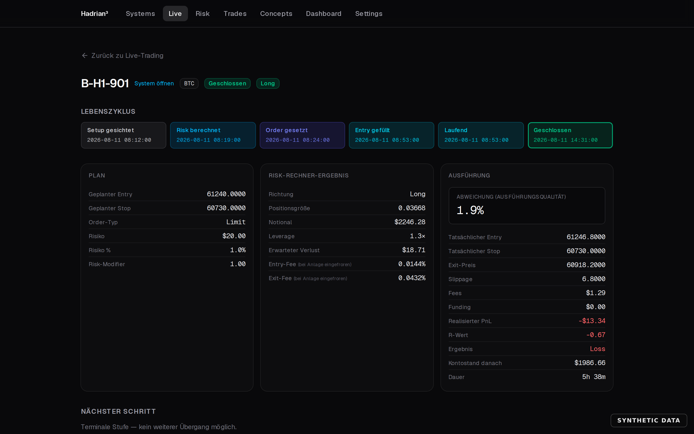
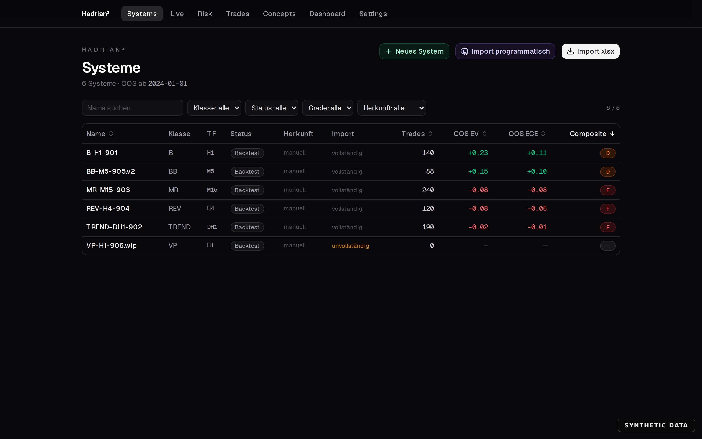
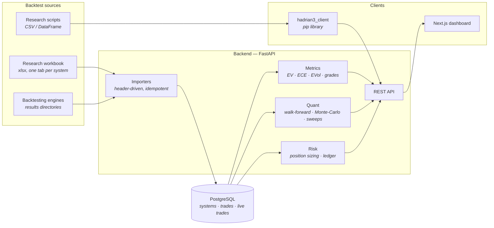
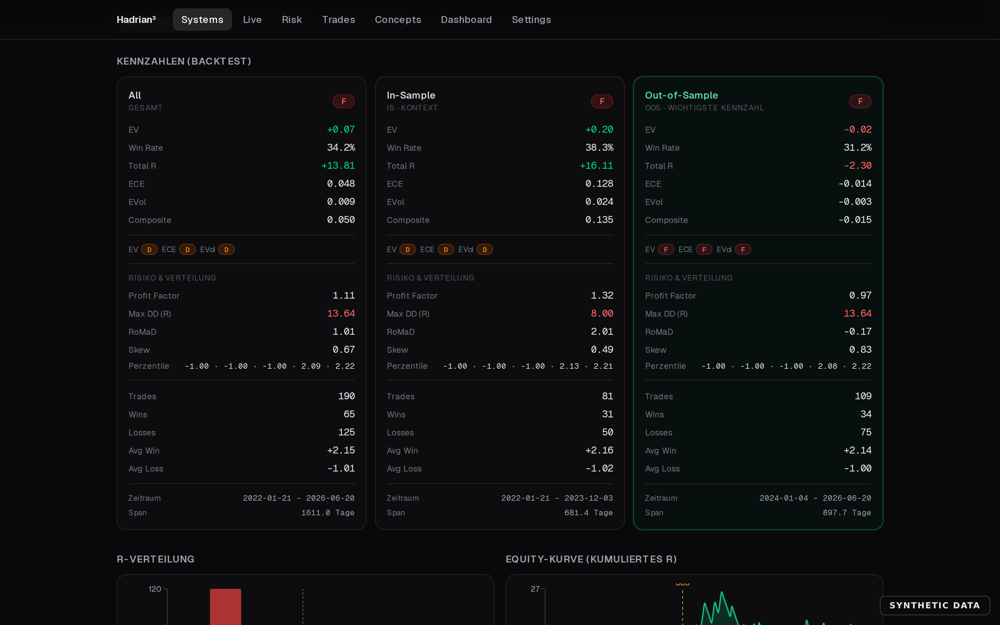
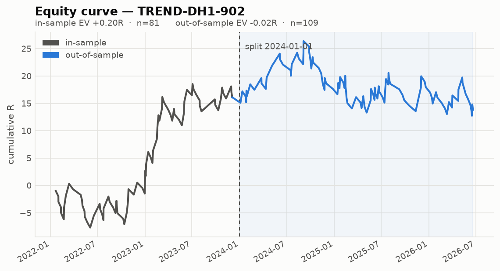
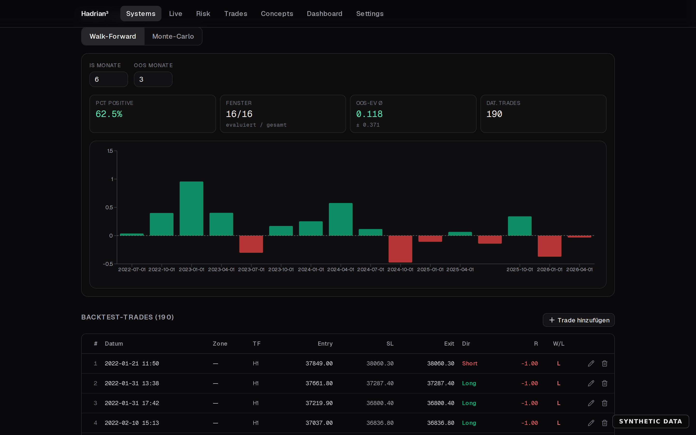
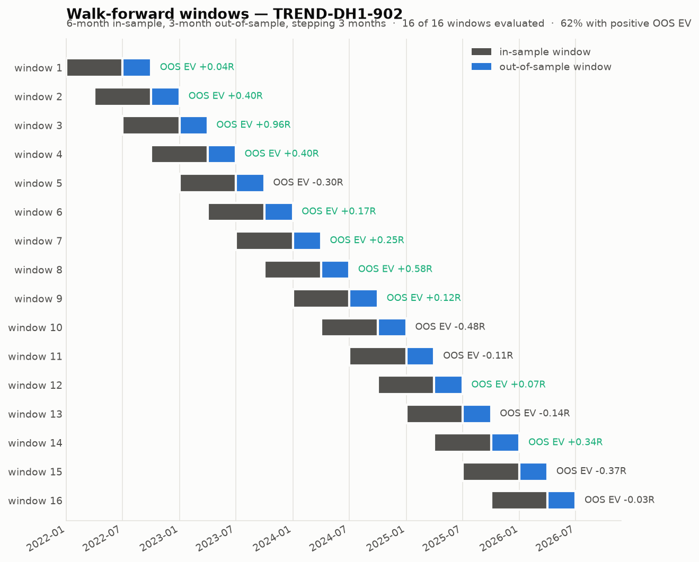
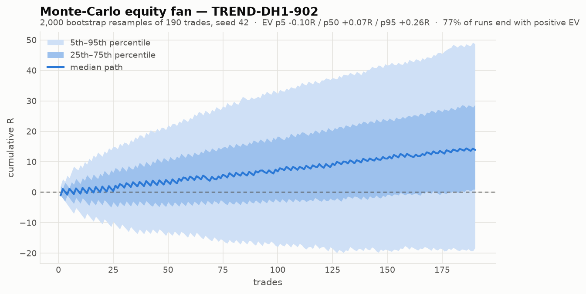

# Hadrian³

A trading-analytics platform that consolidates backtests from several sources
into one Postgres store and reports every system on the same risk-normalised
footing — expectancy in R, in-sample versus out-of-sample, walk-forward
stability and bootstrap confidence intervals.

FastAPI backend · Next.js dashboard · Python client library · one `docker compose up`.

---

## Status: work in progress

This is a personal research tool that is genuinely used, not a finished product.
Being precise about that is more useful than a polished claim:

**What works today**

- **Import** from three sources — a hand-maintained Excel research workbook, and
  the result directories of two upstream Python backtesting engines. Idempotent,
  re-runnable, and hardened against the half-finished tabs that real research
  workbooks are full of.
- **Metrics** — EV, ECE, EVol, composite score and A–F grades, all R-based and
  net of costs, computed from the persisted trades and reconciled against the
  figures the source workbook reports.
- **IS/OOS split** at a configurable date, with every metric computed three ways
  (`all`, `is`, `oos`).
- **Walk-forward analysis** — rolling IS/OOS windows, share of windows with
  positive OOS expectancy.
- **Monte-Carlo** — seeded bootstrap of the R distribution: EV percentiles,
  probability of a positive outcome, and an equity fan.
- **Dashboard** — system list and detail, R histogram, equity curve, trade
  explorer, parameter-sweep topography.
- **Live trade journal** — a six-stage ticket lifecycle with a position-size
  calculator, an append-only balance ledger and execution-quality tracking
  (slippage plus fee deviation against the plan).
- **Backtesting engine** — an event-driven engine that runs a strategy against
  OHLC candles and produces trades in R, net of fees, slippage and funding. A
  signal on one bar fills at the *next* bar's open, and every operand in the
  rule language carries a non-negative bar offset, so lookahead is
  unrepresentable rather than merely avoided. Engine results land in the same
  tables as the imported ones, so the metrics, walk-forward and Monte-Carlo
  above read them with no special-casing.
- **Strategy designer** — write a strategy as a declarative rule tree or as
  Python in an in-browser Monaco editor, version it (saves are append-only,
  never in place), and backtest it from the UI. Untrusted Python runs in a
  four-layer sandbox: an unprivileged network namespace, a CPython audit hook,
  resource limits, and a wall clock.
- **Parameter sweeps** — vary two declared parameters over their declared ranges
  into the topography view above.
- **Order execution — dry-run and testnet only.** Position sizing goes through
  the same verified calculator the live journal uses, scaled by how proven the
  system is. Every order is journalled, simulated ones as completely as real
  ones. **Mainnet is refused**, and the default install cannot sign a
  transaction at all — see [The execution boundary](#the-execution-boundary).
- **Client library** — `hadrian3_client`, for pushing backtests from a research
  script.



*A closed ticket: the six lifecycle stages with their timestamps, the plan, the
sizing the calculator produced, and what actually happened — including the 1.9%
deviation between planned and filled entry. Synthetic sample data throughout. The interface is currently German.*

**What is deliberately incomplete**

- `GET /systems/{id}/report` returns JSON only; there is no PDF rendering.
- Risk rules are schema and read-only listing — no breach checking, no alerting.
- The concept graph (systems ↔ concepts, M:N) is modelled and assignable, but no
  graph analysis is built on it yet.
- **No mainnet trading, by construction.** Execution runs in `DRY_RUN` or
  against Hyperliquid testnet. The testnet *signature* has not yet been
  exercised against the live venue — that needs a funded testnet agent wallet.
  See PROGRESS.md.
- No visual block designer yet. The declarative definition is exactly the shape
  one would emit, so it is additive work rather than a rewrite.
- Sweeps are synchronous and capped at 400 cells.
- **The frontend has no automated tests.** The backend is well covered (see
  [Testing](#testing)); the UI is not covered at all.
- The **UI is in German** while the backend, API and documentation are English.

**What comes next** — see the [roadmap](#roadmap).

---

## The execution boundary

This system builds order execution and arms no mainnet trading. That is
structural rather than a convention someone has to remember:

- `ExecutionMode` names three modes and permits two. `DRY_RUN` (the default)
  opens no socket; `TESTNET` trades the Hyperliquid testnet.
- Mainnet is refused four independent ways. No configuration resolves to it, a
  guard raises on every order path, there is no mainnet exchange URL in the tree
  to send to, and **the default install has no capability to sign a transaction
  at all** — the signing libraries live in `requirements-testnet.txt` and are
  imported at call time. A guard can be removed by a refactor; a library that is
  not installed cannot be.
- `backend/tests/test_execution_boundary.py` reads the source tree rather than
  calling the code, because what is being protected is an invariant of the
  repository rather than a behaviour of the current build.

Reading mainnet *candles* is deliberately not execution: price history is data,
testnet has none worth backtesting, and the market-data client refuses any URL
whose path is not `/info` and holds no key material.

Arming mainnet is a separate, manually reviewed change. PROGRESS.md sets out
the four steps, the last of which starts by making that boundary test fail.

---

## Why it exists

Backtests accumulate in incompatible formats. Some are hand-built in a
spreadsheet, some are produced by a Python engine, each with its own idea of what
"expectancy" means and whether costs were subtracted. Comparing them honestly
becomes guesswork exactly when the stakes rise.

This platform imposes one contract on all of them:

- **Everything is measured in R.** One R is the risk taken on a trade, entry to
  stop. A trade that made twice what it risked is +2R; one that was stopped out
  is −1R. This makes a scalping system and a swing system directly comparable,
  and it makes position size irrelevant to the evaluation.
- **Everything is net of costs.** Gross figures are discarded at import.
- **Out-of-sample expectancy is the number that counts.** In-sample is context.
  The dashboard shows both, always side by side, so a system that only works
  in-sample cannot hide behind a blended figure.
- **Metrics are computed, never stored.** The figures a source reports are kept
  separately and only ever used for reconciliation. Two independently derived
  numbers that must agree beat one number stored twice.



*Every system on the same footing: identical columns, out-of-sample expectancy
first, one composite grade. Synthetic sample data throughout. The interface is currently German.*

---

## Architecture



Importers are the only components that know about source formats. Everything
downstream sees one trade model, which is why adding a source never touches the
metrics layer.

---

## Quickstart

```bash
git clone https://github.com/x88a9/hadrian.git
cd hadrian
cp .env.example .env
docker compose up --build
```

- Dashboard: <http://localhost:3000>
- API docs: <http://localhost:8000/docs>

Then trigger an import from the dashboard, or:

```bash
curl -X POST http://localhost:8000/import/xlsx
```

Out of the box this imports the **synthetic sample workbook** in
[`samples/`](samples/) — six systems, both workbook layout variants and one
deliberately unfinished tab. No private data is required, and nothing in the
sample describes a real trading result. To import your own workbook, point
`XLSX_PATH` at it (see [`.env.example`](.env.example)) or mount it via
`docker-compose.override.yml`.

Running without Docker:

```bash
bash backend/scripts/dev_db.sh                      # embedded Postgres on :55432
cd backend && uvicorn app.main:app --reload         # :8000
cd frontend && npm install && npm run dev           # :3000
```

---

## Methodology

### R, and why everything is expressed in it

`R` is the risk unit — the distance from entry to stop. Every outcome is stated
as a multiple of it, net of fees and funding. Expectancy `EV` is simply the mean
R across trades: the average amount risked that a system returns per trade.

### The metric set

| Metric | Meaning |
| --- | --- |
| `EV` | mean R — expectancy per trade |
| `ECE` | `EV / stdev(R)` — expectancy per unit of volatility |
| `EVol` | `EV × trades per day` — expectancy weighted by how often the system fires |
| Composite | `0.4·EV + 0.4·ECE + 0.2·EVol`, graded A–F |

A system with a high EV that trades four times a year is not obviously better
than a modest one that trades weekly; `EVol` is what keeps those comparable.
Full definitions and grade thresholds: [`docs/DECISIONS.md`](docs/DECISIONS.md).

### In-sample / out-of-sample

The split date is configurable (`IS_OOS_SPLIT_DATE`, default `2024-01-01`).
Everything before it is in-sample, everything from it onwards is out-of-sample,
and metrics are computed for both plus the combined set.



*The same metric set computed separately for all trades, in-sample and
out-of-sample. Here the system grades D in-sample and F out-of-sample, and the
profit factor falls from 1.32 to 0.97 — which is the entire reason the columns
are kept apart. Synthetic sample data throughout. The interface is currently German.*



### Walk-forward

A single IS/OOS split answers one question once. Walk-forward asks it repeatedly:
roll a 6-month in-sample window forward in 3-month steps and evaluate the 3
months that follow each one. What matters is not the average but the *share* of
windows whose out-of-sample expectancy is positive — a system that works in three
of sixteen windows is not a system, whatever its headline EV says.



*The same analysis in the product rather than in an export script: window
length is adjustable and the panel reports the share of windows with positive
out-of-sample expectancy. Synthetic sample data throughout. The interface is currently German.*



### Monte-Carlo

The order in which trades happened is one sample from a distribution. Bootstrap
resampling of the R values gives a confidence band around the outcome and, more
usefully, the probability that the observed edge is noise.



### Research background

Two documents record why the platform is built the way it is. Both concern the
upstream research engine whose output this platform ingests, not the platform
itself, and both are worth reading before trusting any figure in a dashboard.

- **[docs/BENCHMARK_DISCREPANCY.md](docs/BENCHMARK_DISCREPANCY.md)** — a
  headline benchmark of EV≈5.06R turned out never to have been measured. It
  existed only in prompt files and was read back as a result. The rebuild
  produced −0.15R, an engine audit removed three real lookahead defects along
  the way, and the system is now treated as unvalidated. This is the direct
  reason every import here reconciles computed metrics against reported ones
  instead of trusting either.
- **[research/regime/RESEARCH.md](research/regime/RESEARCH.md)** — 2,742 tested
  indicator combinations hit a hard ceiling at 0.73R with no out-of-sample
  survivor, which suggests the missing ingredient is regime selectivity rather
  than better indicators. A hidden-Markov-model agenda for testing that, written
  down before implementation, including the lookahead trap that makes naive
  regime backtests worthless. **Nothing in it is implemented.**

Primary sources for both are archived verbatim under
[`docs/legacy/`](docs/legacy/).

> All three figures are generated by
> [`backend/scripts/generate_docs_figures.py`](backend/scripts/generate_docs_figures.py),
> which runs the platform's own metrics and quant code over the synthetic sample
> workbook. The pipeline is real; the input data is synthetic by construction.
> Regenerate them with
> `python backend/scripts/generate_docs_figures.py`.

---

## Pushing your own backtests

Install the client and push a run straight from a research script:

```python
from hadrian3_client import Client

client = Client("http://127.0.0.1:8000")

client.create_system(
    "MR-H1-042",
    entry_rule="Fade of a 2.5 sigma extension from VWAP",
    sl_rule="1.0 ATR(14) beyond the extension high",
    tp_rule="Return to VWAP",
)

# df carries one row per trade; net_r is the column that matters.
run = client.bulk_import(df, "MR-H1-042", replace=True)
print(run["trades_imported"])
```

`replace=True` makes the push idempotent: the server replaces that system's
previously imported trades rather than appending, so re-running a research script
never doubles the sample. Column contract and the rest of the API:
[`hadrian3_client/README.md`](hadrian3_client/README.md).

To wire up an entirely new source format, add a parser under
`backend/app/importers/` that returns the standard parsed-tab structure. The
metrics and quant layers need no changes — they only ever see persisted trades.

---

## Testing

```bash
bash backend/scripts/dev_db.sh
cd backend && python -m pytest
```

| | |
| --- | --- |
| Backend tests | **342**, 96% statement coverage |
| ...on a fresh clone | **326 pass, 16 skip** (the skipped ones need private data) |
| Frontend tests | **none** |

The suite is green on a fresh clone: tests that assert figures specific to a
private workbook or to the upstream engines skip themselves with an explicit
reason rather than failing. `pytest -rs` prints why.

Those 16 read their inputs from the environment, so no identifier from a private
research setup lives in this repository. What each variable does, and an example
expectations file: [`backend/tests/README.md`](backend/tests/README.md).

The load-bearing test is the reconciliation gate: it re-imports the workbook,
recomputes every metric from the persisted trades and asserts agreement with the
figures the workbook itself reports — relative tolerance `1e-6`, counts and
grades exact. It is the reason a metric change cannot quietly drift.

---

## Roadmap

- Frontend test coverage — the largest gap in the project.
- Translate the UI to English.
- PDF report rendering (the JSON endpoint exists).
- Risk-rule breach checking and alerting.
- Analysis on the concept graph: which market concepts actually carry expectancy
  across systems.
- Port `risk_of_ruin` and `kelly_simulation` from the archived
  [edge-lab](https://github.com/x88a9/edge-lab) predecessor — the two analytics
  it had that this platform does not.
- Exchange connectivity for live execution.

---

## Repository layout

```
backend/          FastAPI app, SQLAlchemy models, Alembic migrations, tests
  app/importers/  one module per source format
  app/services/   metrics, quant, risk, import orchestration
  scripts/        dev database, sample generator, figure generator
  tests/          test suite; see tests/README.md for the optional env vars
frontend/         Next.js App Router dashboard
hadrian3_client/  pip-installable API client
samples/          synthetic sample workbook
docs/             design decisions, figures, and archived research sources
research/regime/  HMM research agenda (not implemented)
```

---

## License

[MIT](LICENSE)
